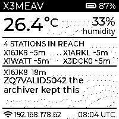

# Waveshare ESP32-S3-ePaper-1.54

An XPRS station with a 200x200 black-and-white e-paper screen, a room
thermometer and a microSD slot. It carries XPRS over **BLE5, the LAN and
ESP-NOW**, repeats and bridges between them, keeps an archive on the card,
and shows one page: the room's temperature and humidity, who is in reach,
the newest messages, and whether it is on the network.

The station is `common/xprs_app`, the same program the T-Deck, the T-Dongle
and the M5Stack run. `firmware/` holds only what makes it this board.

## What is in here

| | |
|---|---|
| `firmware/` | this board's PlatformIO project: panel, sensor, battery, storage |
| `board.yml` | the catalogue entry, machine-readable (`docs/catalog.md`) |
| `sdkconfig.esp32s3_epaper_1in54` | the OLD multiboard build's config (see the end) |
| `docs/` | a screenshot of the page, taken from the board |
| `hardware/` | photographs |

## The screen



`common/xprs_ui_paper` draws the page. It answers to the same `xprs_ui.h`
interface as the colour dashboard and the T-Dongle's strip, so the station
does not know it is talking to e-paper.

```
+------------------------------+
| X3MEAV               [##] 89%|   callsign, battery
| 25.2 C               35%     |   room temperature, humidity
|                      humidity|
|==============================|
| 4 STATIONS IN REACH          |
| X16JK8 ~10m    X1WATT ~5m    |   up to four, distance in coarse steps
| X1ARKL ~2m     X3DCK0 ~10m   |
|==============================|
| X16JK8  18m                  |   the newest message: who, when,
| ZQ7VALID5042 the archiver    |   and two lines of it
| kept this                    |
| X1ARKL: meet at the pier     |   the one before, on one line
|==============================|
| (wifi) 192.168.178.62  07:44 |   address, clock; with no LAN,
+------------------------------+   "join XPRS-X3MEAV" (the hotspot)
```

E-paper is not an LCD, and the page is built around that:

- **It only refreshes when the picture changes.** LVGL renders the whole
  page, every pixel is thresholded to black or white, and the result is
  compared with what the panel already shows. Only a real difference is sent,
  and never sooner than a minute after the last one (`XUP_MIN_COMMIT_MS`).
  With the clock on the page that is one partial refresh a minute at most.
- **Nothing on it moves for its own sake.** No seconds, no packet counter, no
  flashing receive dot. Distances come in steps (2, 5, 10, 20, 50, 100 m) and
  a new step is shown only when two readings agree. Temperature moves only
  by 0.3 C or more, humidity and battery by 2%, and the stations keep their
  places (sorted by callsign) instead of reshuffling whenever one is heard.
- **Partial refreshes, with a full one every 40** (or every hour). A partial
  update takes a fraction of a second and does not flash; it leaves a faint
  ghost, which the full refresh (2.2 s, with the usual black-white flash)
  clears. The first picture after a boot is always a full refresh.
- **The panel is driven from its own task** (`firmware/src/epd.c`, core 1),
  so the UI task never waits for the glass.

The station fills in one dashboard panel at a time, and this page needs two
of them (home for the stations in reach, chat for the messages). So the board
runs the hands-off tour (`rotate = true`), and the page keeps the latest of
each. The messages are at most a minute and a half old.

## Turning the page

The USB cable decides how the board can stand, so **every press of BOOT or
PWR turns the page 90 degrees clockwise**, with a full refresh. The angle is
kept in NVS where the old firmware kept it (`display` / `rotation`, in
degrees), so a board set up under the old build comes up the way it was left.
This one did: it booted turned 90 degrees.

The turn is applied when the frame is packed for the panel (`pack_turned()`
in `firmware/src/main.c`), not in the UI: the page is square, so its layout
never changes. Screenshots show the page upright, the way it is read.

The buttons are not passed to the station as keys. Any key would stop the
hands-off tour, and the tour is how the page gets both halves. A button that
is already down at boot is ignored until released, because on battery the
board is switched on by holding PWR.

## The clock

The clock shows local time, found out by the station itself: once it
reaches the internet it asks worldtimeapi.org which zone it is in, and
ip-api.com when that does not answer (both see the station's public
address). It follows daylight saving: worldtimeapi.org names the next change
and the station applies it on time; otherwise it asks again just after each
full hour. The last answer is kept, so a reboot starts in the right zone.
This is shared code (`common/xprs_tz`), so every station does the same.

Until a zone is known the clock says "UTC" after the time. To pin a zone
instead, or to stop the lookup:

```
cfg set tz +02:00      # pinned: no lookup, no daylight saving
cfg del tz             # back to automatic
cfg set tz_auto no     # never ask; the clock shows UTC
```

Each takes effect within a minute, without a restart. A station whose
`config.ini` was saved through the config share before this existed may hold
`tz = +00:00`, which now counts as pinned; `cfg del tz` frees it.

## Temperature and humidity

The SHTC3 sits in the case next to an ESP32-S3 running WiFi and Bluetooth
all day, so it reads warm, and by more than the old build assumed. Calibrated
on the bench board with a thermometer in the same room (2026-09-11, warm,
on USB): the room was 23.0 C and the sensor read 34.4 C, so the firmware
subtracts **11.4 C** (`TEMP_SELF_HEAT_C` in `firmware/src/main.c`). The old
6 C left the page at 28.4.

Humidity needs the same care. Relative humidity is relative to the air's
temperature, and the sensor's air is 11 C warmer than the room's, so the same
water reads about half as humid there (28% at the sensor was 54% in the
room). The firmware carries the water across to the room's temperature
(Magnus formula, same vapour pressure) before showing or sending it.

The log prints both every five minutes:

```
epaper: climate: 22.9 C 54% RH (sensor 34.3 C 28%)
```

**Right after a cold power-on the reading is low**, because the correction
is for a warm board and the board takes a while to warm up. Check against
a thermometer again after the board has run for half an hour, and change the
constant if it disagrees.

## On the air

Every minute the station reports the room as a signed observation
(XPRS.md 15.3), on every bearer it has, and keeps it in its own archive:

```
t:observation f:X3MEAV intemp:23C inhum:54% ts:2026-09-11_09:09:37 sig:<60 characters>
```

142 bytes. `intemp:` and `inhum:` are the indoor keys, because the sensor is
in a room and a neighbour should not read it as the air outside. Whole
degrees and whole percent, because the number of decimals is the precision
claimed, and a reading corrected by 11 C of the board's own heat is good to
about a degree. A reading more than a minute old is not sent at all.

The period is the board's default (`report_s = 60` in `main.c`); change it
without rebuilding with `cfg set report_s <seconds>` (0 stops the reports,
10 is the floor). Section 30.1 says a beacon is not free: this board only has
local bearers, but a neighbour with LoRa may relay the report onto a
duty-cycled channel, so a longer period is kinder to a busy network.

## Storage

The V1 board has 4 MB of flash. Two 1.5 MB app slots for over-the-air
updates leave 832 KB for files, and one index segment is 1.3 MB, so the
archive cannot live in the flash: the segment being written can never be
evicted and would fill the volume. So `storage_mount` in `main.c` mounts:

- **the microSD card at `/idx`**, when one is in the slot. The archive gets the
  same 10 MB as on every other board. The card is **never formatted** by the
  firmware: a card that does not mount is reported and left alone.
- **the flash otherwise**, holding the log, the statistics and the
  conversation, with no archive. The boot log says so (`archive: none`).

`xapp_board_t.storage_mount` (in `common/xprs_app/include/xprs_app.h`) is
the hook that makes this possible. Boards that do not set it behave exactly
as before.

## Building and flashing

```sh
cd firmware
~/.pio-venv/bin/pio run            # build
~/.pio-venv/bin/pio run -t upload  # flash
```

Copy `src/wifi_secrets.h.example` to `src/wifi_secrets.h` and
`src/fw_secrets.h.example` to `src/fw_secrets.h` first; both are gitignored.
`platformio.ini` pins the port to this bench's board by its USB serial
number (`B8:F8:62:D8:BF:20`); change it for another one.

**Coming from the old firmware** (or anything with a single `factory`
partition): the old table put `phy_init` where `otadata` now is, so clear
that sector once, or the bootloader reads stale bytes as boot data. The S3's
ROM loader has no `erase_region` without the flasher stub, which this board
cannot use, so write erased bytes instead:

```sh
python3 -c "open('/tmp/ff8k.bin','wb').write(b'\xff'*8192)"
esptool.py --port <port> --no-stub write_flash 0xF000 /tmp/ff8k.bin
```

NVS keeps its place at 0x9000, so the station keeps its identity across the
move. This one did: it was X3MEAV before and after.

## Verifying it

A screenshot of what the panel shows (not what LVGL has drawn since):

```sh
python3 ../../tools/scripts/framedump.py \
  --port /dev/serial/by-id/usb-Espressif_USB_JTAG_serial_debug_unit_B8:F8:62:D8:BF:20-if00 \
  --cmd S /tmp/epaper.png
```

or `curl http://<address>/api/screen > screen.bmp`. What neither can tell you
is whether the glass is the right way up: only looking at the board does.

## Measured, first boot (V1, 2026-09-11)

| | |
|---|---|
| PSRAM | 2 MB found, 80 MHz, memory test OK |
| internal heap before BLE | 234,516 (largest 172,032) |
| after BLE | 195,024 |
| after WiFi and the API | 100,232 (largest 36,864) |
| running, no hotspot | ~74,000 free, largest 31,744, lowest 69,748 |
| image | 1,431,345 bytes, 91% of a 1.5 MB slot |
| full refresh | 2,155 ms |
| microSD | 32 GB card, mounted, archive on it |
| after the hotspot | 65,612 (largest 31,744) |
| running, hotspot up | ~58,500 free, lowest 55,216 |
| task stacks, free | climate 1,932 and panel 1,896 of 3,072 |

## The hotspot

The walk-up hotspot, `XPRS-<callsign>`, is on by default: this board goes
where there may be no LAN, and then its own access point with the chat page
is the only way a phone reaches it. With no LAN the page's footer says which
network to join ("join XPRS-X3MEAV").

The station keeps trying its configured LAN, and every try is a scan across
all channels, which on one radio takes the hotspot off its channel. So after
five quick tries it asks once a minute, or once every five minutes while a
phone is on the hotspot (`sta_retry_ms()` in `common/xprs_app/xprs_app.c`).
Tested by pointing the station at a network that does not exist: five tries
two seconds apart, then one a minute, with the hotspot up throughout.

With a LAN the hotspot stays up too; on battery with nobody on it, the power
policy takes it down and brings it back every twenty minutes (`xprs_power`).
`cfg set ap_on 0` turns it off. A board first flashed before this default
existed has `ap_on=0` saved and needs `cfg set ap_on 1` once.

## Not used yet

The PCF85063 RTC, and the ES8311 codec with the microphone and speaker.
Their pins are in `firmware/src/board.h`.

## The old build

`sdkconfig.esp32s3_epaper_1in54` and the `esp32s3_epaper_1in54` target in
`multiboard/` are the firmware this board ran before `xprs_app` existed (web
chat over ESP-Mesh-Lite, no XPRS bearers). They are kept for reference and
are not maintained.
