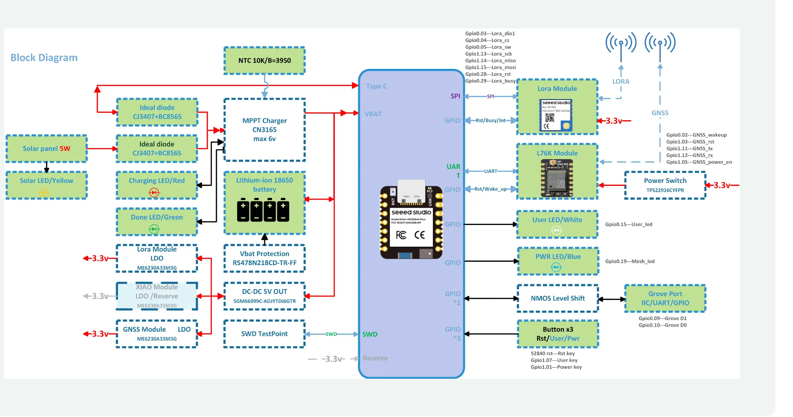
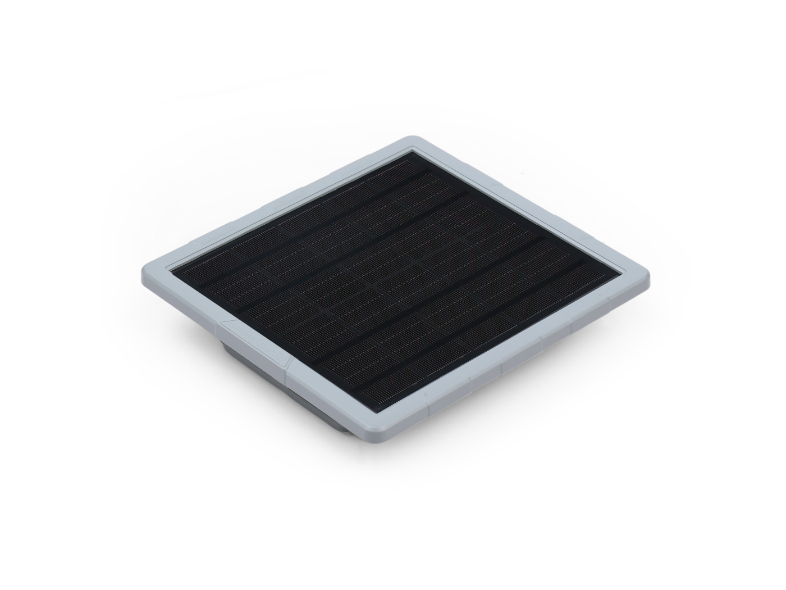
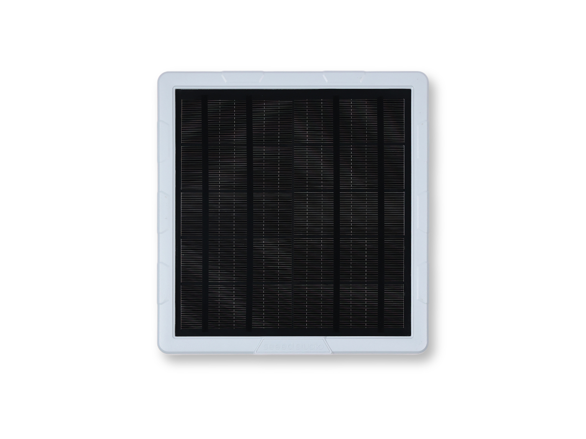
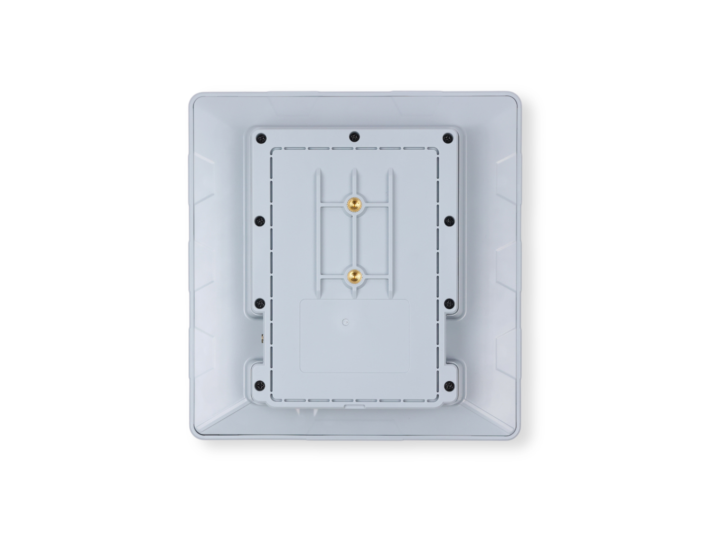
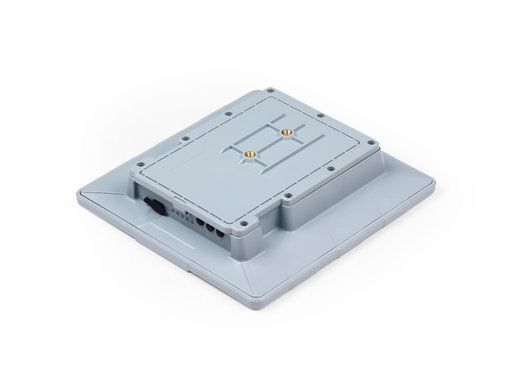
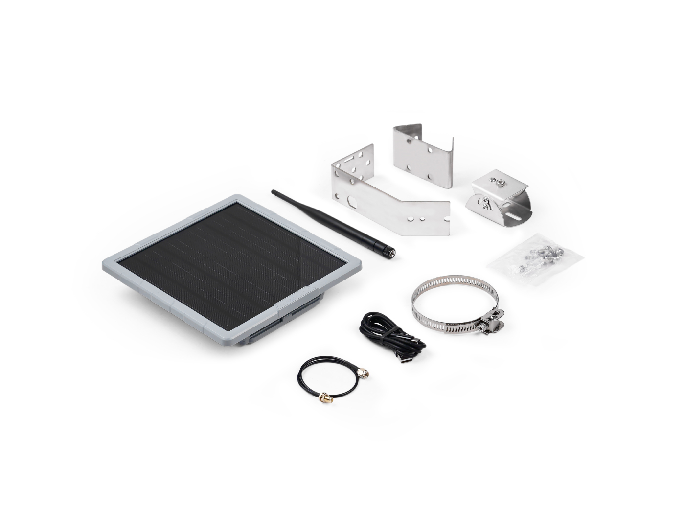
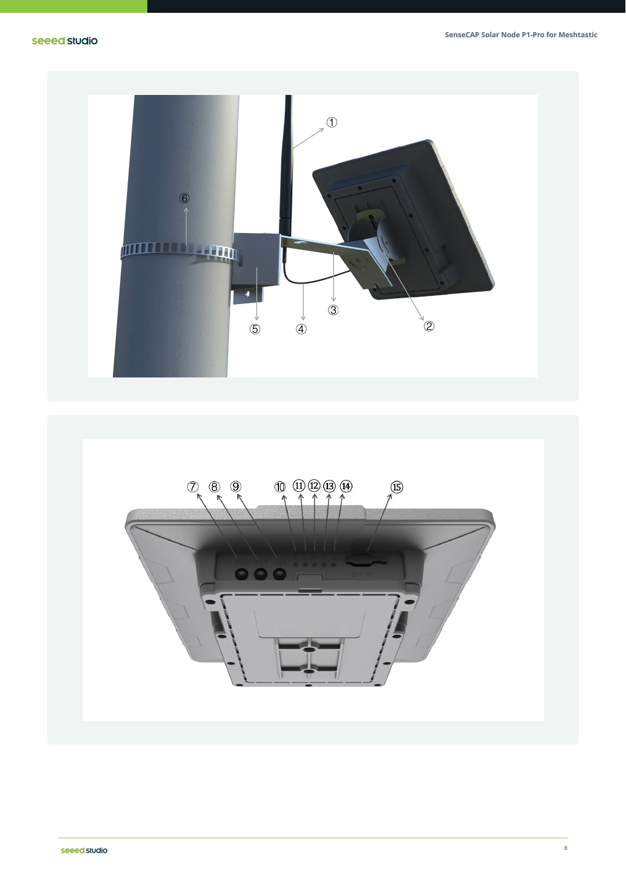

# SenseCAP Solar Node P1-Pro hardware



*Seeed Studio, industrial datasheet for SKU 114993633.*

Everything on this page is read off that diagram and off the datasheet's
specification table.

**What has since been confirmed on the device**: the eight LoRa pins and the
two LED pins, because firmware built on them talks to a T-Deck in both
directions and lights both LEDs (`../README.md`). The GNSS pins, the buttons,
the Grove port and the battery divider are still the datasheet's word alone
-- nothing has driven them.

## What it is made of

| | |
|---|---|
| MCU module | XIAO nRF52840 Plus -- Nordic nRF52840, Cortex-M4F @ 64 MHz, 256 KB RAM, 1 MB flash, plus 2 MB QSPI flash |
| LoRa | Wio-SX1262 module -- Semtech SX1262, 22 dBm, 862-930 MHz |
| GNSS | XIAO L76K -- GPS L1 C/A 1575.42, GLONASS L1 1602, BeiDou B1 1561.098 MHz |
| Bluetooth | nRF52840 radio, Bluetooth 5 |
| WiFi | **none** |
| Solar | 5 W panel, CN3165 MPPT charger (6 V max), NTC 10K B=3950 on the pack |
| Battery | 4 x 18650 Li-ion, 3350 mAh each, button-top |
| Antenna | RP-SMA, rod-shaped rubber, 868-915 MHz, 2 dBi |
| Case | 191.2 x 201.2 x 42.1 mm, pole bracket |

## Pin map

Nordic pins are written `Pn.mm`, which is how the datasheet writes them and
how Zephyr's devicetree wants them (`&gpio0 3`, `&gpio1 13`). The datasheet's
own `GpioX.YY` spelling means the same thing.

### LoRa -- SX1262 on SPI

| Signal | Pin |
|---|---|
| `LORA_SCK` | P1.13 |
| `LORA_MISO` | P1.14 |
| `LORA_MOSI` | P1.15 |
| `LORA_CS` | P0.04 |
| `LORA_RST` | P0.28 |
| `LORA_BUSY` | P0.29 |
| `LORA_DIO1` | P0.03 |
| `LORA_SW` | P0.05 |

`LORA_SW` is the RF switch / antenna path control, not a chip select. The
module runs off its own 3.3 V LDO (ME6230A33M3G).

### GNSS -- L76K on UART

| Signal | Pin |
|---|---|
| `GNSS_TX` | P1.11 |
| `GNSS_RX` | P1.12 |
| `GNSS_RST` | P1.03 |
| `GNSS_WAKEUP` | P0.02 |
| `GNSS_POWER_EN` | P1.05 |

`GNSS_POWER_EN` drives a TPS22916CYFPR load switch, so the receiver can be
cut off entirely rather than merely told to sleep -- which is the difference
that matters on a solar node.

### Buttons

| Button | Pin |
|---|---|
| Reset | nRF52840 `RESET` -- hardware, not a GPIO |
| User | P1.07 |
| Power | P1.01 |

### LEDs

| LED | Pin | Colour |
|---|---|---|
| User | P0.15 | white |
| Mesh (silkscreened PWR) | P0.19 | blue |
| Charging | -- | red |
| Charge done | -- | green |
| Solar present | -- | yellow |

The last three are wired to the CN3165 charger and are **not reachable from
firmware**. A node that wants to signal battery state has the two MCU LEDs
and nothing else.

### Grove

| Signal | Pin |
|---|---|
| `GROVE_D1` | P0.09 |
| `GROVE_D0` | P0.10 |

Behind an NMOS level shift. P0.09 and P0.10 are the nRF52840's **NFC
antenna pins** in their reset state; using them as ordinary GPIO needs
`CONFIG_NFCT_PINS_AS_GPIOS`, which is written once to UICR and takes a power
cycle. A first bring-up that finds a dead Grove port should look here before
anywhere else.

### Debug

SWD is brought to a test point on the PCB. It is not accessible without
opening the case, so the practical path is the UF2 bootloader over USB-C.

## Power

```
5W panel ─┬─ ideal diode (CJ3407+BC856S) ─┐
USB-C ────┴─ ideal diode ─────────────────┴─ CN3165 MPPT (max 6 V) ─ 4x18650
                                                                       │
                                          Vbat protection (RS478N218CD) │
                                                                       ├─ VBAT to XIAO
                                          DC-DC 5V (SGM66099C) ────────┘
```

Both inputs are 5 V 1 A. The NTC on the pack is the charger's, not the
MCU's.

## What is NOT documented

The blanks in `board.yml` are these, and they are blank because Seeed does
not publish them:

- **Weight.** Not in the datasheet.
- **IP rating.** The datasheet says only "suitable for long-term outdoor
  use". There is no IP figure, so none is claimed here.
- **Operating temperature of the electronics.** The -40..60 / 0..50 figures
  are the *battery's* discharge and charge windows.
- **Battery sense.** VBAT reaches the XIAO module, but no ADC pin for
  reading it is named on the block diagram. On a bare XIAO nRF52840 it is
  P0.31 behind an enable on P0.14; whether the Plus carrier keeps that is
  unverified and must be measured before any firmware reports a battery
  percentage.
- **Idle and TX current.** No power-consumption figures are given, which for
  a solar node is the number one would most want.

## Photographs

| | |
|---|---|
|  |  |
| Panel side | With the antenna fitted |
|  |  |
| Pole-mounted | The four cells and the carrier board |
|  |  |
| Ports and buttons underneath | Datasheet callouts, numbered 1-15 with no legend printed |

All Seeed Studio's, from the product listing and the datasheet.
